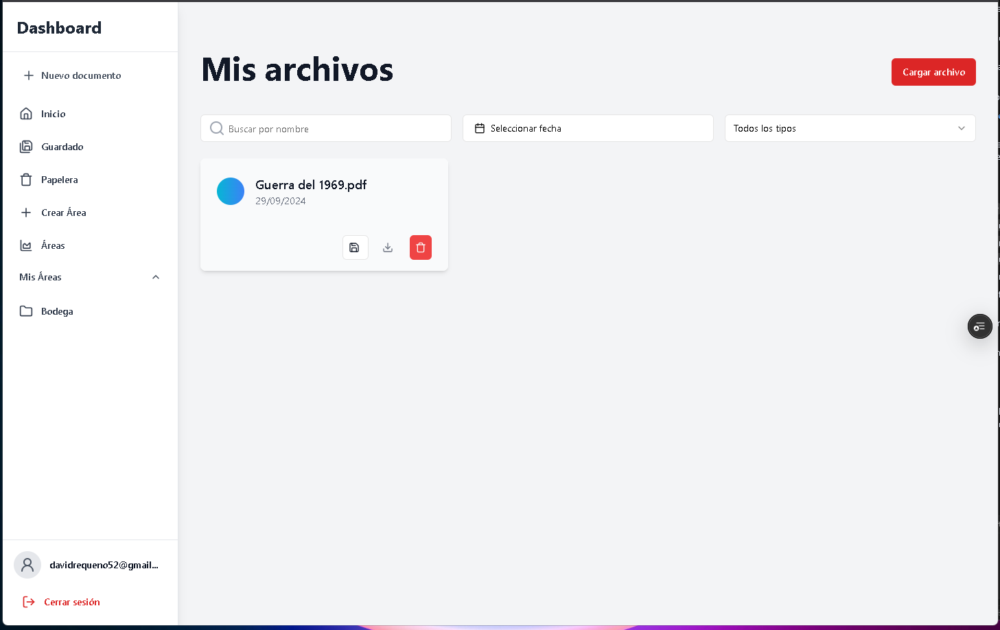
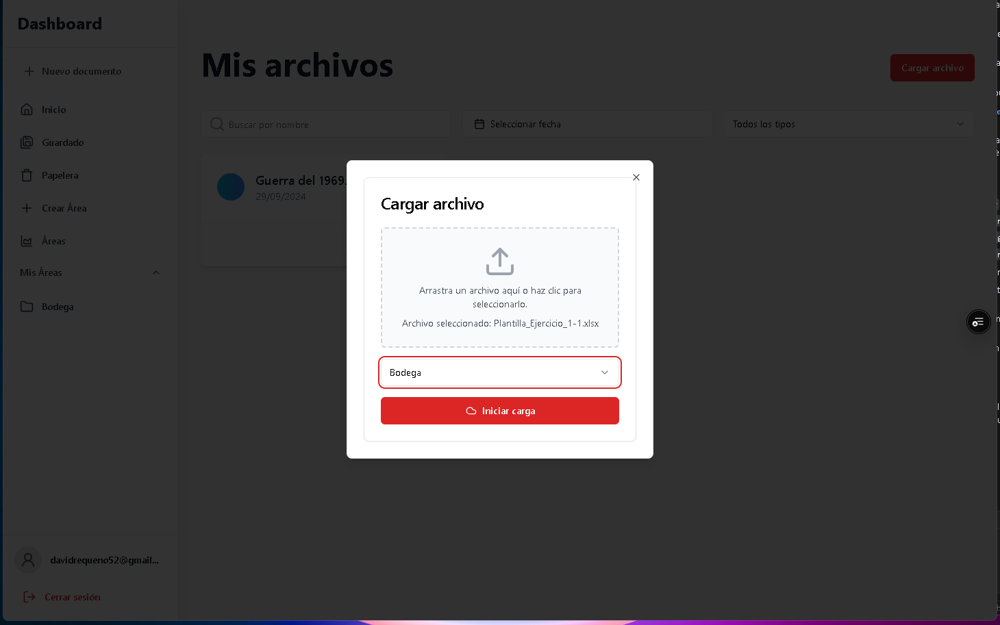
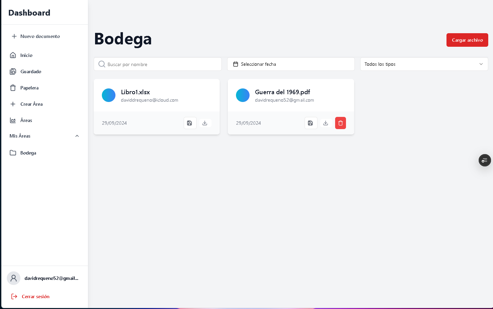
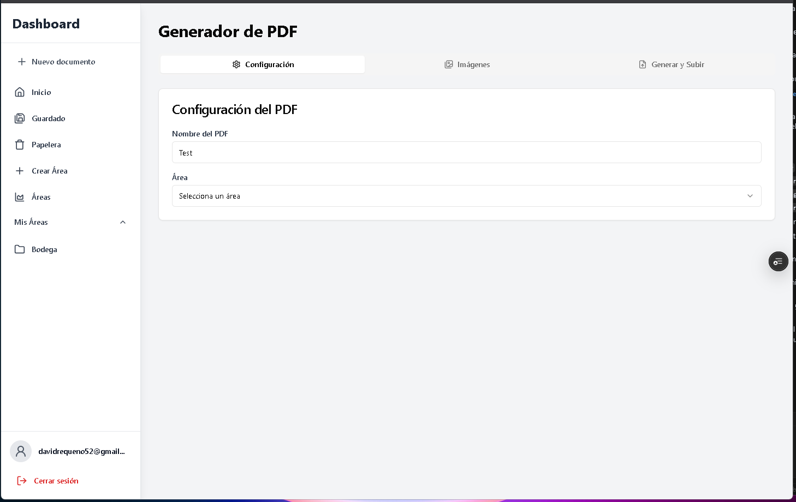
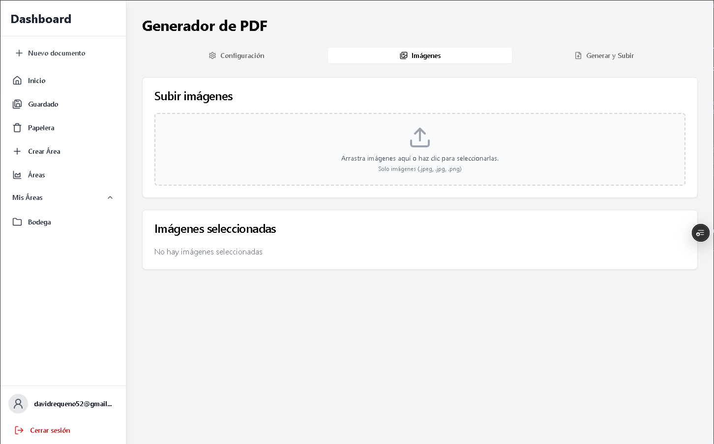
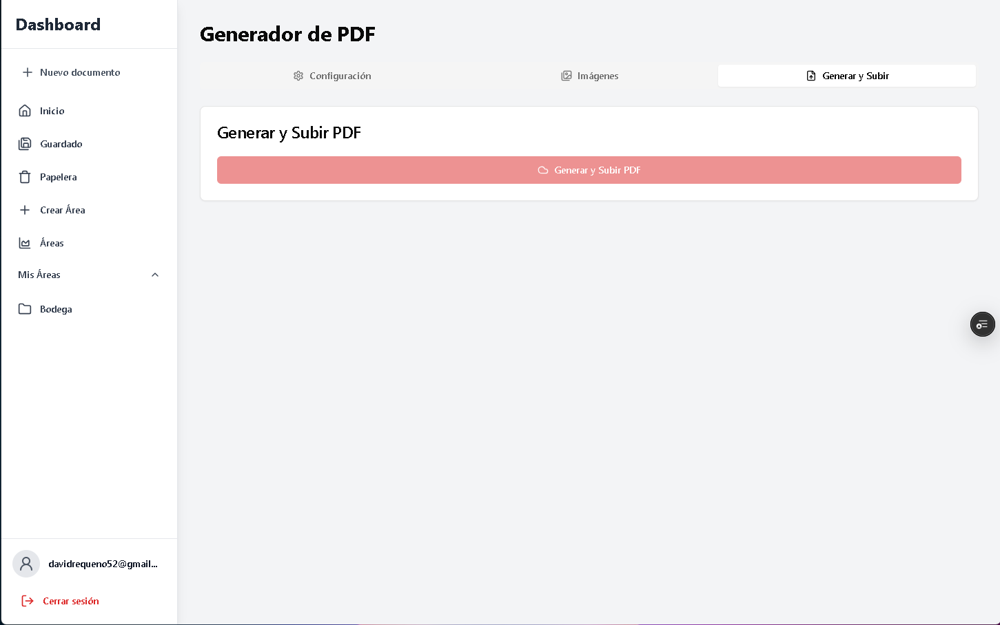
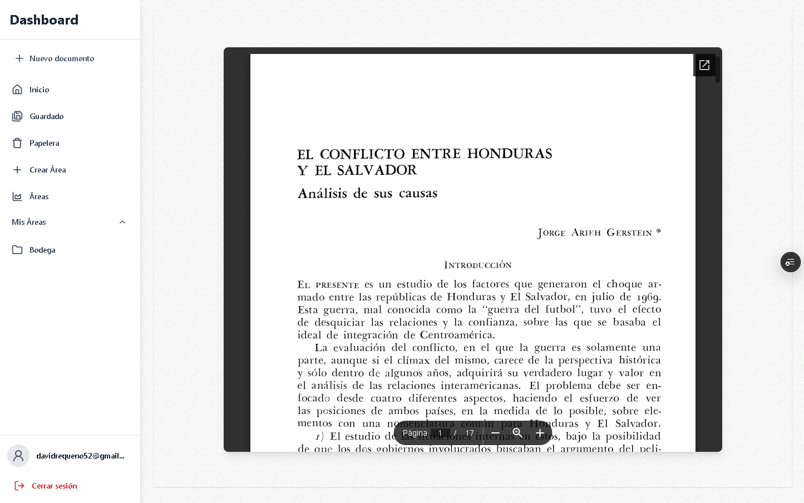

# Area-Based Document Management System

## 🚀 Description

Enterprise document management system that enables organization and control of files by departmental areas. Implements a robust access control system, cloud file management, and automatic document generation.

## 📸 Screenshots

### Dashboard


_Main dashboard showing area overview and recent files_

### File Management


_Advanced file management interface with drag-and-drop support_

### Areas


_Area administration panel with user management_

### Document Generation







### Document Preview



## ✨ Key Features

- 🔐 **Granular Access Control**

  - Area-based role system (Admin/Member)
  - Department-level permission management
  - Secure authentication with Kinde Auth

- 📁 **Advanced File Management**

  - Support for multiple formats (PDF, Word, Excel, Images)
  - Secure storage in AWS S3
  - Recycle bin system
  - Automatic document generation

- 🎯 **Technical Highlights**
  - Modern architecture with Next.js 14
  - Type-safe APIs with tRPC
  - ORM with Prisma and PostgreSQL
  - Modern UI with Shadcn and Tailwind CSS
  - Efficient state management with React Query

## 🛠️ Tech Stack

- **Frontend:**

  - Next.js 14
  - TypeScript
  - Shadcn UI
  - Tailwind CSS
  - React Query

- **Backend:**

  - tRPC
  - Prisma ORM
  - PostgreSQL
  - AWS S3

- **DevOps & Tools:**
  - ESLint
  - TypeScript
  - Prisma
  - AWS SDK

## 🚀 Quick Start

1. **Clone the repository**

   ```bash
   git clone [repository-url]
   ```

2. **Install dependencies**

   ```bash
   pnpm install
   ```

3. **Set up environment variables**

   ```bash
   cp .env.example .env
   ```

   Edit `.env` with your credentials for:

   - PostgreSQL
   - AWS S3
   - Kinde Auth

4. **Initialize the database**

   ```bash
   pnpm prisma generate
   pnpm prisma db push
   ```

5. **Start the development server**
   ```bash
   pnpm dev
   ```

## 🔒 Security

- Robust authentication with Kinde Auth
- Role-based access control
- Secure storage in AWS S3
- Data validation with Zod

## 🎯 Enterprise Features

- **Scalability:** Architecture ready for growth
- **Maintainability:** Clean and well-structured code
- **Performance:** Optimized for fast loading
- **Security:** Implementation of best practices
- **UX/UI:** Modern and responsive interface

## 🤝 Contributing

Contributions are welcome. Please read the contribution guidelines before submitting a pull request.

## 📝 License

This project is licensed under the MIT License - see the [LICENSE.md](LICENSE.md) file for details.
